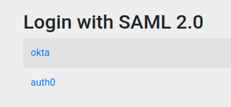

# Saml Login 🌱

Este repositório contém uma autenticação utilizando o SAML com base no blog [okta developer](https://developer.okta.com/blog/2022/08/05/spring-boot-saml). O projeto tem autenticação bilateral, integração com Okta e Auth0 como provedores de identidade (IdPs). Além disso, o exemplo implementa logout, gerenciamento de grupos e atributos de usuários.

  

## 📚 Referências 

- https://developer.okta.com/blog/2022/08/05/spring-boot-saml
- https://git.rnp.br/gidlab/sp-spring-security-saml2
- https://codetinkering.com/spring-security-saml2-service-provider-example/
- https://codetinkering.com/saml2-spring-security-5-2-tutorial/
- https://docs.spring.io/spring-security/reference/servlet/saml2/logout.html
